# Dr. Strange Agentic Flow Diagram

## Complete Multi-Agent Drug-Drug Interaction Analysis System

```mermaid
graph TD
    %% User Input
    A[User Input: Drug1 + Drug2] --> B[FastAPI Endpoint /predict]
    B --> C[Lookup Drug Database]
    
    %% Drug Database
    C --> D{Both Drugs Found?}
    D -->|No| E[Return Error: Drugs Not Found]
    D -->|Yes| F[Create DrugInfo Objects]
    
    %% Specialist Agents Phase
    F --> G[🔬 Specialist Agents Analysis Phase]
    
    G --> H1[Chemical Analyst Agent]
    G --> H2[Pathway Analyst Agent] 
    G --> H3[Target Analyst Agent]
    G --> H4[Similarity Analyst Agent]
    
    %% Agent Inputs
    H1 --> I1[Analyze Chemical Properties<br/>SMILES, Molecular Weight, etc.]
    H2 --> I2[Analyze Shared Pathways<br/>Metabolic Pathways, Biological Processes]
    H3 --> I3[Analyze Shared Targets<br/>Protein Targets, Receptors]
    H4 --> I4[Analyze Structural Similarity<br/>Molecular Structure, Analogs]
    
    %% Agent Processing
    I1 --> J1[Chemical Analysis JSON]
    I2 --> J2[Pathway Analysis JSON]
    I3 --> J3[Target Analysis JSON]
    I4 --> J4[Similarity Analysis JSON]
    
    %% Summarization Phase
    J1 --> K1[Presenter Agent<br/>Summarize Chemical Analysis]
    J2 --> K2[Presenter Agent<br/>Summarize Pathway Analysis]
    J3 --> K3[Presenter Agent<br/>Summarize Target Analysis]
    J4 --> K4[Presenter Agent<br/>Summarize Similarity Analysis]
    
    %% Specialist Results
    K1 --> L1[Chemical Summary]
    K2 --> L2[Pathway Summary]
    K3 --> L3[Target Summary]
    K4 --> L4[Similarity Summary]
    
    %% Coordinator Phase
    L1 --> M[Coordinator Agent]
    L2 --> M
    L3 --> M
    L4 --> M
    
    J1 --> M
    J2 --> M
    J3 --> M
    J4 --> M
    
    M --> N[Final Verdict JSON<br/>Risk Score + Reasoning]
    
    %% Final Processing
    N --> O[Final Executive Summary<br/>Presenter Agent]
    N --> P[Risk Label Classification<br/>Risk Labeler Agent]
    
    %% Output Assembly
    O --> Q[Final Results Assembly]
    P --> Q
    
    Q --> R[Return Complete Analysis:<br/>• Agent Responses<br/>• Final Verdict<br/>• Executive Summary<br/>• Risk Label]
    
    %% Styling
    classDef userInput fill:#e1f5fe,stroke:#01579b,stroke-width:2px
    classDef agent fill:#f3e5f5,stroke:#4a148c,stroke-width:2px
    classDef specialist fill:#e8f5e8,stroke:#1b5e20,stroke-width:2px
    classDef coordinator fill:#fff3e0,stroke:#e65100,stroke-width:2px
    classDef presenter fill:#fce4ec,stroke:#880e4f,stroke-width:2px
    classDef output fill:#e0f2f1,stroke:#004d40,stroke-width:2px
    classDef error fill:#ffebee,stroke:#c62828,stroke-width:2px
    
    class A,B userInput
    class H1,H2,H3,H4 specialist
    class M coordinator
    class K1,K2,K3,K4,O presenter
    class R output
    class E error
```

## Agent Roles and Responsibilities

### Specialist Agents (Parallel Analysis)
1. **Chemical Analyst**: Analyzes molecular properties, SMILES structures, physicochemical characteristics
2. **Pathway Analyst**: Examines shared metabolic pathways and biological processes
3. **Target Analyst**: Identifies common protein targets and receptors
4. **Similarity Analyst**: Compares structural similarity and identifies drug analogs

### Coordination Agents (Sequential Processing)
1. **Presenter Agent**: Summarizes complex JSON analyses into human-readable summaries
2. **Coordinator Agent**: Synthesizes all specialist analyses into final verdict with risk score
3. **Risk Labeler Agent**: Classifies final risk into categories (Very High, High, Moderate, Low, None)

## Data Flow Stages

### Stage 1: Input Processing
- User provides two drug names
- System validates against drug database
- Creates DrugInfo objects with SMILES, targets, pathways

### Stage 2: Specialist Analysis (Parallel)
- All 4 specialist agents run simultaneously
- Each agent receives specific drug data relevant to their expertise
- Agents return detailed JSON analyses

### Stage 3: Summarization (Parallel)
- Presenter agent processes each specialist analysis
- Creates concise, professional summaries
- Handles edge cases (e.g., no shared targets)

### Stage 4: Coordination
- Coordinator agent receives all raw analyses and summaries
- Synthesizes information into final verdict
- Calculates overall risk score

### Stage 5: Final Processing (Parallel)
- Presenter agent creates executive summary
- Risk Labeler agent classifies risk level
- Results assembled into final response

## Error Handling

- **Drug Not Found**: Returns error if drugs not in database
- **Agent Failures**: Individual agent errors don't stop entire pipeline
- **JSON Parsing**: Robust error handling for malformed responses
- **Fallback Summaries**: Manual summaries when presenter agent fails

## Performance Optimizations

- **Parallel Processing**: Specialist agents run simultaneously
- **Async Operations**: Non-blocking API calls to Letta agents
- **Session Reuse**: HTTP session management for efficiency
- **Timeout Handling**: 90-second timeout per agent call 